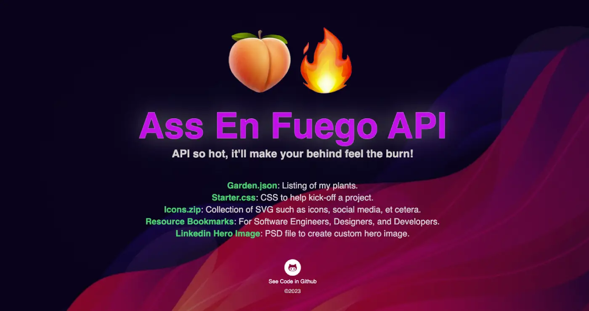

# Ass En Fuego API

This is an Express API designed to serve various types of data, such as JSON and images, and it has been deployed on Firebase on Google Cloud Platform (GCP). It was specifically created for BocaCode C-9.

 

## Site
* 👉 [assenfuego.com](https://assenfuego.com/)
